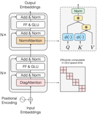

# Transnormer

Official implementation of Transnormer in our EMNLP 2022 paper - [The Devil in Linear Transformer](https://arxiv.org/abs/2210.10340).


## Overall Architecture

{:height="10%" width="10%"}


## Experiments

### Environment Preparation

Our experiment uses two conda environments, where **Autoregressive language modeling**, **Bidirectional language modeling** need to configure the environment according to the NLP part, and **Long Range Arena Benchmark** needs to configure the environment according to LRA part.

#### NLP

First build the conda environment based on the yaml file:

```
conda env create --file environment.yml
```

Then install our version of fairseq:

```
git clone https://github.com/OpenNLPLab/fairseq-evo.git
cd fairseq
pip install --editable ./
```


#### LRA

wip.


### Autoregressive language modeling

#### 1) Preprocess the data

First download and prepare the [WikiText-103 dataset](https://www.salesforce.com/products/einstein/ai-research/the-wikitext-dependency-language-modeling-dataset/):

```
path_to_fairseq=fairseq
cd $path_to_fairseq/examples/language_model/
bash prepare-wikitext-103.sh
cd ../..
```

Next preprocess/binarize the data:

```
TEXT=examples/language_model/wikitext-103
fairseq-preprocess \
    --only-source \
    --trainpref $TEXT/wiki.train.tokens \
    --validpref $TEXT/wiki.valid.tokens \
    --testpref $TEXT/wiki.test.tokens \
    --destdir data-bin/wikitext-103 \
    --workers 20
```

This step comes from [fairseq](https://github.com/facebookresearch/fairseq/blob/main/examples/language_model/README.md).


#### 2) Train a language model

Use the following command to train language model:

```
bash train_lm.sh n_gpu arch path_to_bin_data
```

where `n_gpu` is the number of GPUs you use, the arch is chosen from `transnormer_t1` and `transnormer_t2`, and `path_to_bin_data` is the path of preprocessing data.


### Bidirectional language modeling


### Long Range Arena Benchmark


## Todo

- [ ] Bidirectional language modeling
- [ ] Long Range Arena Benchmark
- [ ] transnormer-pytorch
