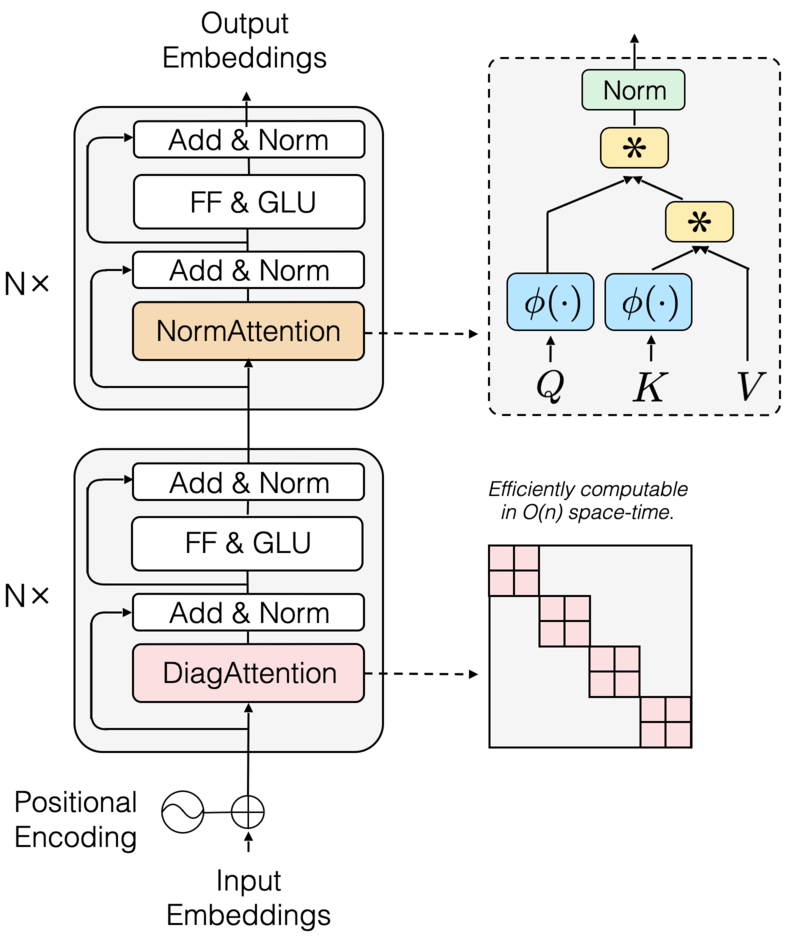

# Transnormer

Official implementation of Transnormer in our EMNLP 2022 paper - [The Devil in Linear Transformer](https://arxiv.org/abs/2210.10340).


## Overall Architecture

<div  align="center"> </div>

 

## Experiments

### Environment Preparation

Our experiment uses two conda environments, where Autoregressive language modeling, Bidirectional language modeling needs to configure the environment according to the NLP part, and Long Range Arena Benchmark needs to configure the environment according to the LRA part.

#### NLP

First build the conda environment based on the yaml file:

```
conda env create --file environment.yml
```

Then install our version of fairseq:

```
git clone https://github.com/OpenNLPLab/fairseq-evo.git
cd fairseq
pip install --editable ./
```


#### LRA

wip.


### Autoregressive language model

#### 1) Preprocess the data

First download and prepare the [WikiText-103 dataset](https://www.salesforce.com/products/einstein/ai-research/the-wikitext-dependency-language-modeling-dataset/):

```
path_to_fairseq=fairseq
cd $path_to_fairseq/examples/language_model/
bash prepare-wikitext-103.sh
cd ../..
```

Next preprocess/binarize the data:

```
TEXT=examples/language_model/wikitext-103
fairseq-preprocess \
    --only-source \
    --trainpref $TEXT/wiki.train.tokens \
    --validpref $TEXT/wiki.valid.tokens \
    --testpref $TEXT/wiki.test.tokens \
    --destdir data-bin/wikitext-103 \
    --workers 20
```

This step comes from [fairseq](https://github.com/facebookresearch/fairseq/blob/main/examples/language_model/README.md).


#### 2) Train the autoregressive language model

Use the following command to train language model:

```
bash train_alm.sh n_gpu arch path_to_bin_data
```

where `n_gpu` is the number of GPUs you use, the arch is chosen from `transnormer_t1` and `transnormer_t2`, and `path_to_bin_data` is the path of preprocessing data.


### Bidirectional language model

#### 1) Preprocess the data

First download the [WikiText-103 dataset](https://www.salesforce.com/products/einstein/ai-research/the-wikitext-dependency-language-modeling-dataset/):

```
wget https://s3.amazonaws.com/research.metamind.io/wikitext/wikitext-103-raw-v1.zip
unzip wikitext-103-raw-v1.zip
```

Next encode it with the GPT-2 BPE:

```
mkdir -p gpt2_bpe
wget -O gpt2_bpe/encoder.json https://dl.fbaipublicfiles.com/fairseq/gpt2_bpe/encoder.json
wget -O gpt2_bpe/vocab.bpe https://dl.fbaipublicfiles.com/fairseq/gpt2_bpe/vocab.bpe
for SPLIT in train valid test; do \
    python -m examples.roberta.multiprocessing_bpe_encoder \
        --encoder-json gpt2_bpe/encoder.json \
        --vocab-bpe gpt2_bpe/vocab.bpe \
        --inputs wikitext-103-raw/wiki.${SPLIT}.raw \
        --outputs wikitext-103-raw/wiki.${SPLIT}.bpe \
        --keep-empty \
        --workers 60; \
done
```

Finally preprocess/binarize the data using the GPT-2 fairseq dictionary:

```
wget -O gpt2_bpe/dict.txt https://dl.fbaipublicfiles.com/fairseq/gpt2_bpe/dict.txt
fairseq-preprocess \
    --only-source \
    --srcdict gpt2_bpe/dict.txt \
    --trainpref wikitext-103-raw/wiki.train.bpe \
    --validpref wikitext-103-raw/wiki.valid.bpe \
    --testpref wikitext-103-raw/wiki.test.bpe \
    --destdir data-bin/wikitext-103 \
    --workers 60
```

This step comes from [fairseq](https://github.com/facebookresearch/fairseq/blob/main/examples/roberta/README.pretraining.md).


#### 2) Train the bidirectional language model

Use the following command to train language model:

```
bash train_blm.sh n_gpu arch path_to_bin_data
```

where `n_gpu` is the number of GPUs you use, the arch is chosen from `roberta_transnormer_t1` and `roberta_transnormer_t2`, and `path_to_bin_data` is the path of preprocessing data.


### Long Range Arena Benchmark


## Todo

- [ ] Bidirectional language modeling
- [ ] Long Range Arena Benchmark
- [ ] transnormer-pytorch
